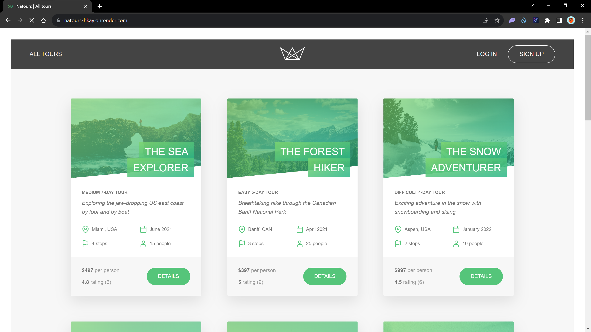
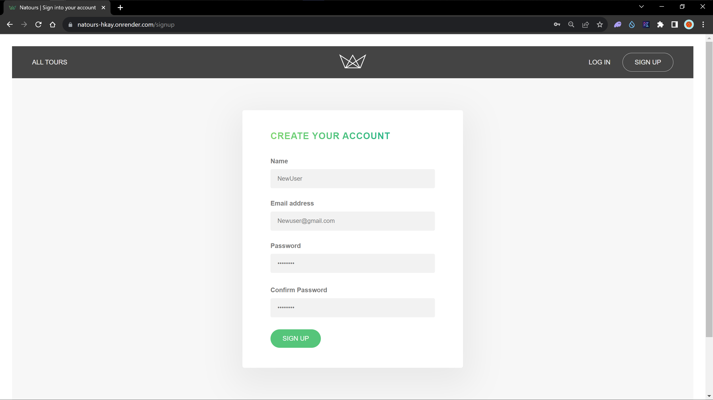
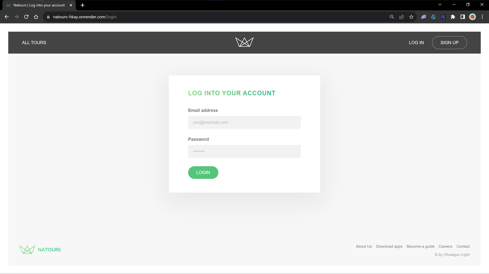
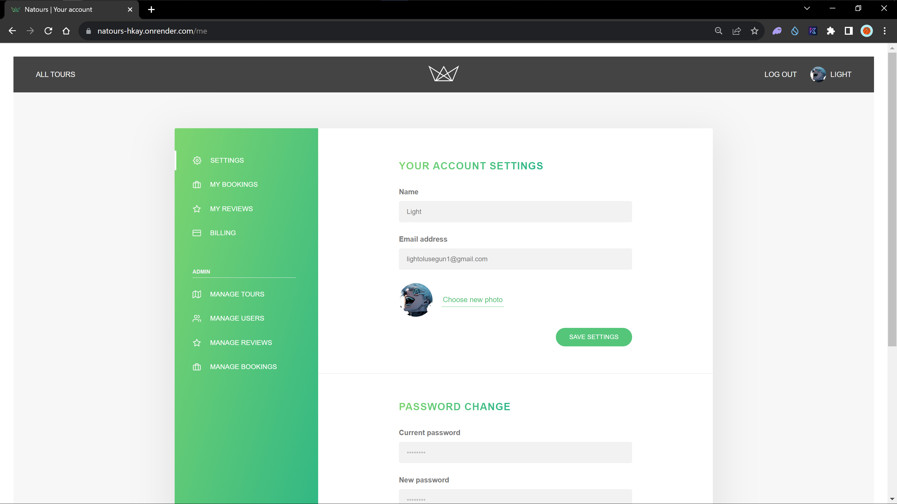
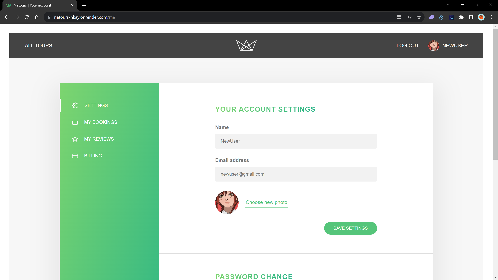
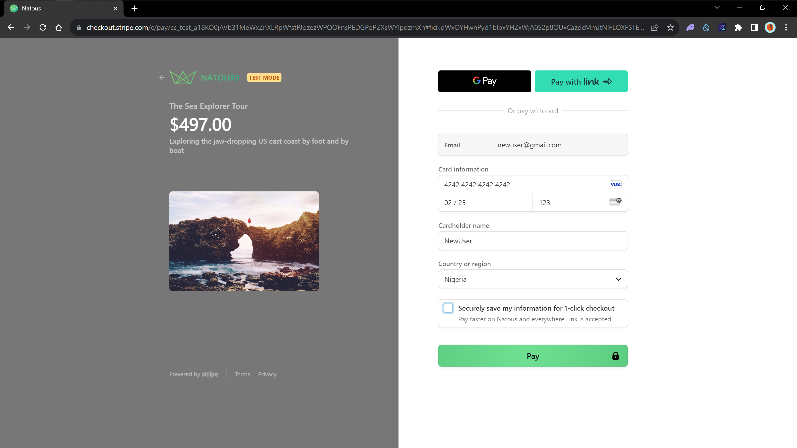
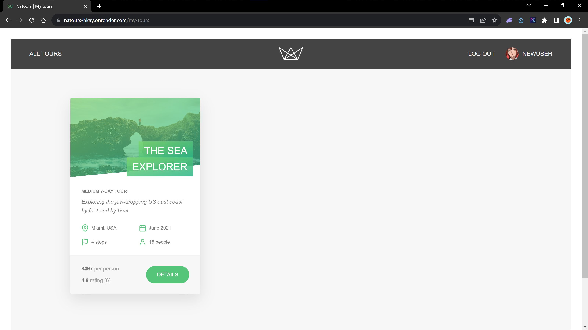

# Natours: Tourisim Web App



Welcome to the Natours: Tourisim Web App! Discover exciting tours, share your experiences, and manage user profiles through this comprehensive API. Whether you're an adventure seeker, a tour operator, or an administrator, the Natours API offers a range of functionalities to enhance your journey.

**Tours**
Explore a diverse collection of tours, each with its own unique charm and adventure. Retrieve tour details, ratings, and prices, or create, update, and delete tours as a tour operator. Get insights into tour statistics and discover upcoming tours in your desired location.

**Reviews**
Share your thoughts and feedback on tours by leaving reviews. The Reviews API enables you to create, update, and delete your reviews, allowing you to express your genuine experiences with other travelers.

**Bookings**
Plan your trips with ease by making bookings for your favorite tours. Create bookings, retrieve booking details, and manage your bookings effortlessly. The Bookings API provides the functionality you need to reserve your spot on exciting adventures.

**Users**
Connect with fellow travelers, manage your own profile, and enjoy seamless authentication. Sign up to join the Natours community, log in to access your account, or reset your password if needed. Update your profile details, or choose to deactivate your account.

Explore the Natours API to make the most of your adventure and connect with like-minded travelers from around the world. Happy exploring!

## Table of Contents

- [Introduction](#introduction)
- [Features](#features)
- [Getting Started](#getting-started)
  - [Prerequisites](#prerequisites)
  - [Installation](#installation)
- [How to Use Natours](#how-to-use-natours)
- [Authentication](#authentication)
- [Routes](#routes)
- [Error Handling](#error-handling)
- [Contributing](#contributing)

## Introduction

Welcome to the Natours documentation. This API provides various functionalities for managing users, tours, reviews, and more. It offers a wide range of features to create, read, update, and delete data.

## Features

- User authentication and authorization.
- CRUD operations for users, tours, and reviews.
- Advanced querying with sorting, filtering, and pagination.
- Password reset functionality.
- Tour statistics and aggregation.
- Geospatial querying for tours.
- Error handling middleware.
- Route protection and role-based access control.

## Getting Started

### Prerequisites

- Node.js (v16)
- npm

### Installation

1. Clone the repository:

   ```bash
   git clone https://github.com/Olusegun-Light/Natours.git
   cd Natours
   ```

2. Install dependencies:

   ```bash
   npm install
   ```

3. Set up environment variables by creating a `config.env` filew ith the following variables.

   ```env
   PORT=
   DATABASE=
   DATABASE_PASSWORD=
   DATABASE_USERNAME=
   JWT_SECRET=
   JWT_EXPIRED_IN=
   JWT_COOKIE_EXPIRES_IN=
   EMAIL_USERNAME=
   EMAIL_PASSWORD=
   EMAIL_HOST=
   EMAIL_PORT=
   ```

4. Start the server:

   ```bash
   npm run dev
   ```

## How to Use Natours

Discover the simplicity of navigating through Natours with these easy steps:

### Page Overview (Home Page)


### Create Your Account (Signup)

Fill in the form with your unique email, ensuring each email is exclusive to a user. Confirm your password to complete the signup.


### Login into your account (Login)

If you already have an account, simply log in.


### Upon Successful Login or Account Creation

You'll be redirected to the home page.


### Access Your Profile

Click the icon displaying your name to visit your profile. Here, you can adjust settings, view bookings, and check tour reviews.


### Admin Profile



### Initial Profile for New Accounts

New users are provided with a default profile, which can be customized at any time. After modifying your Name, Email, or photo, simply click the Save Settings button to apply these changes.


### Booking Tours with Stripe

Make secure tour bookings with Stripe. For test payments, use the details provided in the image.


### Review Your Bookings

Take a looks at tours booked by checking your user profile, click `My Bookings`


Experience the joy of your vacation with Natours! ❤️

## Authentication

Authentication is implemented using JWT (JSON Web Tokens). To access protected routes, you need to sign up or log in to get a JWT token. Include the JWT token in the `Authorization` header as `Bearer [token]` for authorization.

## Routes

- **User Routes:** Manage user accounts, authentication, and profile updates.
- **Tour Routes:** Manage tour information, statistics, and geospatial queries.
- **Review Routes:** Handle reviews associated with tours.
- **Error Routes:** Middleware for handling errors.

For detailed information about the available routes, refer to the [API Routes Documentation.](#api-usage)

## Error Handling

Errors are effectively handled using custom error classes and middleware.The API returns appropriate error responses based on the nature of the error. Depending on the environment (development or production), error messages and details are returned to the client.

## API Usage

Once the server is up and running, you can use the provided API endpoints to interact with the system. Here are some example API requests:

### User Authentication

- **Sign Up:** Create a new user account.
  `POST /signup`

- **Log In:** Log in with existing credentials to get an authentication token.
  `POST /login`

- **Forgot Password:** Request a password reset token to reset your password.
  `POST /forgotPassword`

- **Reset Password:** Use a reset token to set a new password.
  `PATCH /resetPassword/:token`

### User Profile

- **Get My Profile:** Retrieve the profile of the authenticated user.
  `GET /me`

- **Update My Profile:** Update the profile details of the authenticated user.
  `PATCH /updateMe`

- **Delete My Account:** Deactivate the account of the authenticated user.
  `DELETE /deleteMe`

### Tours

- **Get All Tours:** Retrieve a list of all available tours.
  `GET /tours`

- **Get Tour by ID:** Retrieve detailed information about a specific tour.
  `GET /tours/:id`

- **Create Tour:** Create a new tour (requires admin or lead-guide privileges).
  `POST /tours`

- **Update Tour:** Update details of a specific tour (requires admin or lead-guide privileges).
  `PATCH /tours/:id`

- **Delete Tour:** Delete a tour (requires admin or lead-guide privileges).
  `DELETE /tours/:id`

### Reviews

- **Get All Reviews:** Retrieve all reviews associated with tours.
  `GET /tours/:tourId/reviews`

- **Get Review by ID:** Retrieve a specific review by its ID.
  `GET /tours/:tourId/reviews/:id`

- **Create Review:** Create a new review for a tour (requires user privileges).
  `POST /tours/:tourId/reviews`

- **Update Review:** Update a review (requires user or admin privileges).
  `PATCH /tours/:tourId/reviews/:id`

- **Delete Review:** Delete a review (requires user or admin privileges).
  `DELETE /tours/:tourId/reviews/:id`

### View Routes

In addition to the API routes, there are routes dedicated to rendering templates for various views:

- **Overview:** Render the overview of all tours.
  `GET /`

- **Tour:** Render the details of a specific tour.
  `GET /tour/:slug`

- **Login Form:** Render the login form.
  `GET /login`

- **Signup Form:** Render the signup form.
  `GET /signup`

- **Account:** Render the user's account details.
  `GET /me
`
- **My Tours:** Render the user's booked tours.
  `GET /my-tours`

- **User Data Submission:** Handle user data submission for updating profile information.
  `POST /tours`

- To learn more about the API, explore the [Tourism API repository](https://github.com/Olusegun-Light/Tourisim-API).

## Postman Collection

You can explore and test the API endpoints using the provided Postman collection. The collection includes all the defined API routes along with example requests and responses.

[](https://documenter.getpostman.com/view/20337559/2s9Y5SWm44)

Click the "Run in Postman" button above to import the collection into your Postman workspace.

Please note that you'll need to have Postman installed on your machine to use the collection effectively.

## Contributing

Contributions are welcome! If you find any issues or have improvements to suggest, feel free to create a pull request.

1. Fork the repository
2. Create your feature branch: `git checkout -b feature/new-feature`
3. Commit your changes: `git commit -m 'Add some feature'`
4. Push to the branch: `git push origin feature/new-feature`
5. Open a pull request

## Packages Used

- [axios](https://www.npmjs.com/package/axios)
- [bcryptjs](https://www.npmjs.com/package/bcryptjs)
- [compression](https://www.npmjs.com/package/compression)
- [cookie-parser](https://www.npmjs.com/package/cookie-parser)
- [cors](https://www.npmjs.com/package/cors)
- [crypto](https://nodejs.org/api/crypto.html)
- [dotenv](https://www.npmjs.com/package/dotenv)
- [express](https://www.npmjs.com/package/express)
- [express-jwt](https://www.npmjs.com/package/express-jwt)
- [express-mongo-sanitize](https://www.npmjs.com/package/express-mongo-sanitize)
- [express-rate-limit](https://www.npmjs.com/package/express-rate-limit)
- [helmet](https://www.npmjs.com/package/helmet)
- [hpp](https://www.npmjs.com/package/hpp)
- [jsonwebtoken](https://www.npmjs.com/package/jsonwebtoken)
- [jwks-rsa](https://www.npmjs.com/package/jwks-rsa)
- [mongoose](https://www.npmjs.com/package/mongoose)
- [morgan](https://www.npmjs.com/package/morgan)
- [multer](https://www.npmjs.com/package/multer)
- [nodemailer](https://www.npmjs.com/package/nodemailer)
- [parcel-bundler](https://www.npmjs.com/package/parcel-bundler)
- [pug](https://www.npmjs.com/package/pug)
- [sharp](https://www.npmjs.com/package/sharp)
- [slugify](https://www.npmjs.com/package/slugify)
- [stripe](https://www.npmjs.com/package/stripe)
- [validator](https://www.npmjs.com/package/validator)
- [xss-clean](https://www.npmjs.com/package/xss-clean)
